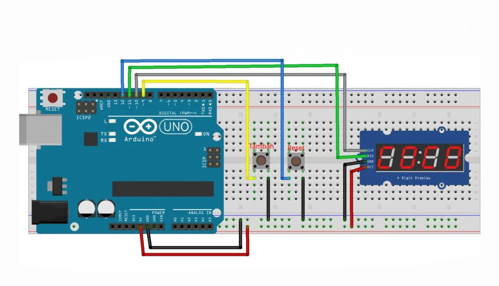

# Score Counter based on Arduino Uno

## Description:

- Seven Segment is an Electronic component that can display decimal numbers through combinations of its segments. Seven Segment Display has 7 Segments where each segment is controlled ON and OFF to display the desired number. Numbers from 0 (zero) to 9 (Nine) can be displayed using several combinations of Segments. In this project, seven segments are used as a score counter display tool.

## Component (Tools & Materials):

- Arduino = 1 unit;
- Breadboard = 1 unit;
- Pushbutton = 2 unit;
- Seven segment TM1637 = 1 unit.

## Circuit Schematic:



## Sketch Program

```cpp
#include <TM1637Display.h>

#define CLK 10
#define DIO 11
#define TEST_DELAY   300
TM1637Display display(CLK, DIO);
uint8_t blank[] = { 0x0, 0x0, 0x0, 0x0 };
const int tambahPin = 9;
const int resetPin = 12;
const int touchDelay = 500;
int count = 0;

void setup() {  //Pengaturan Pin dan Variabel
  pinMode(tambahPin, INPUT);
  pinMode(resetPin, INPUT_PULLUP);
  display.setBrightness(0x0f);// pengatur kecerahan display
  uint8_t data8888[] = { 0xff, 0xff, 0xff, 0xff };  // all segments show
  display.setSegments(data8888); // menampilkan 8888 sebagai penanda set up sistem
  delay(3000);// delay set up
  display.setSegments(blank); // menampilkan nilai kosong
  display.showNumberDec(0);// menampilkan nilai 0
}

void loop() {  //Perulangan Program
  int tambahValue = digitalRead(tambahPin);
  if (tambahValue == LOW) {  // apabila tombol tambah bernilai LOW
    count++;// tambah counter
    display.setSegments(blank);  //menampilkan nilai kosong
    display.showNumberDec(count);  // display counter
    delay(touchDelay);
  }

  if (digitalRead(resetPin) == LOW) { // apabila reset tambah bernilai LOW
    count = 0; // reset counter;
    display.setSegments(blank);// menampilkan nilai kosong
    display.showNumberDec(count);// display counter
  }
}
```

## Conclusion:

- This program is a counter program using push buttons and Seven Segment TM1637. This program will function as a counter every time the add button is pressed, the number will increase and will be displayed on the seven segment TM1637. Then there is a reset button to restart the count from 0.
